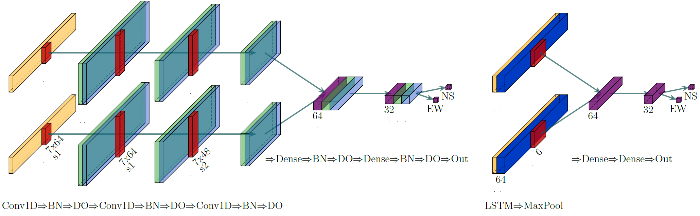
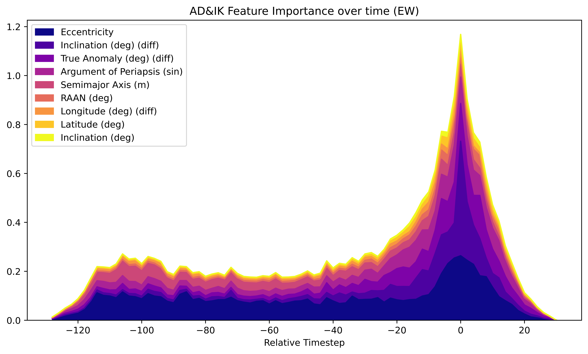

<div align="center">

# AI SSA Algorithm
**Satellite Pattern-of-Life Identification Algorithm developed for the *MIT ARCLab Prize for AI Innovation in Space 2024* Challenge.**

<p align="center">
  <a href="https://eval.ai/web/challenges/challenge-page/2164/overview">Challenge</a> •
  <a href="https://www.researchgate.net/publication/374083350_AI_SSA_Challenge_Problem_Satellite_Pattern-of-Life_Characterization_Dataset_and_Benchmark_Suite">Challenge Paper</a> •
  <a href="https://splid-devkit.readthedocs.io/en/latest/dataset.html">SPLID Dataset</a>
  
  
</p>

[]()
[]()


<p align="center">
  
</p>
<div align="left">

## Directory Overview

```
.
├── base/
│   ├── classifier.py        # Classifier code (prediction & evaluation)
│   ├── datahandler.py       # Data preprocessing, dataset generation
│   ├── evaluation.py        # Challenge-Evaluation
│   ├── localizer.py         # Localizer / Changepoint-Detection code
│   ├── prediction_models.py # Wrapper for creating and training ML models
│   ├── shap_analysis.py     # Code to perform SHAP feature analysis
│   └── utils.py             # Miscellaneous code
│
├── dataset/                    # Dataset directory
├── models/                     # Trained models and pre-fitted scalers
├── classifier_playground.ipynb # Jupyter notebook to train, evaluate and explore the classifier algorithm
├── classifier_sweeper.py       # Code to execute thorough parameter studies for the classifier
├── localizer_playground.ipynb  # Jupyter notebook to train, evaluate and explore the changepoint-detection algorithm
├── localizer_sweeper.py        # Code to execute thorough parameter studies for the localizer
├── data_analysis.ipynb         # Notebook to explore the datasets (unstructured)
├── model_analysis.ipynb        # Notebook to perform SHAP feature importance analysis
└── submission.py               # File to execute the full inference algorithm (changepoint localization, classification, postprocessing)
```

## Installation

The repository was tested using `Python 3.10` together with `TensorFlow 2.15.0` on Ubuntu 22.04

The dataset can be downloaded from [here](https://www.dropbox.com/scl/fo/jt5h1f82iycjb8elybmlz/h?rlkey=bjcmny486ddf7m0j7b9uok9ww&dl=0). Make sure to download the `phase_2` dataset, and extract it into the `dataset` directory.

The dataset directory should look like this:

```
dataset/
└── phase_2/
    ├── test/
    ├── training/
    ├── test_label.csv
    └── train_label.csv
```

A `conda` installation is recommended:

```
conda create -n ai_ssa python=3.10
conda activate ai_ssa
pip install -r requirements.txt
```

**To recreate the challenge results**:
```
python submission.py    # this will perform a full inference cycle, and should yield an F2 score of 0.805
```

## Training and Evaluating Custom Models

Instructions on how to train and evaluate custom models can be found in the corresponding Jupyter notebooks. For larger parameter studies, it is recommended to use the [Weights & Biases](https://wandb.ai/) parameter sweeper implemented in `classifier_sweeper.py` and `localizer_sweeper.py`. The files have been pre-filled with the paramters used in the submission models; the only difference is that `legacy_diff_transform` has been disabled, as it corresponds to [a bug that was fixed](https://github.com/DavidBaldsiefen/splid-challenge/commit/4e86f6bfe4576f90e0b4055091ca8f88632e5a75) in the meantime. Please note that when using newly trained models for inference in `submission.py`, the dataset generation parameters will need to be changed according to the training configuration. 

Models that were re-trained with otherwise identical settings after implementing the fix can also be found in the `models/` directory.
For convenience the `FIXED_DIFF_TRANSFORM_MODELS` was added on top of the `submission.py`, which allows for an easy comparison of the models before and after the fix was applied.


## Analyzing Trained Models

The `model_analysis.ipynb` notebook contains the code necessary to run the [SHAP](https://github.com/shap/shap) `GradientExplainer` on the trained models. While model explainability is a complex topic in itself, the plots do give a general idea of why the model is acting in a certain way. Still, the importance assigned to certain features by the `GradientExplainer` does not always match experimental results.


<p align="center">
  
</p>

